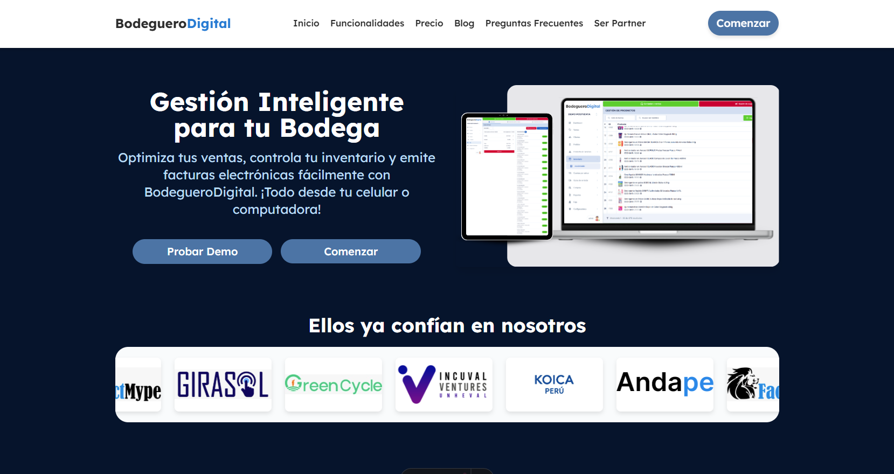

# 🛒 BodegueroDigital

**BodegueroDigital** optimiza tus ventas, controla tu inventario y te permite emitir facturas electrónicas fácilmente. ¡Todo desde tu celular o computadora! Es la solución ideal para bodegas y negocios que buscan digitalizar su operación sin complicaciones.

  

## 🚀 Tecnologías utilizadas

- [Astro](https://astro.build/) — Framework moderno para sitios rápidos y optimizados.
- [Tailwind CSS](https://tailwindcss.com/) — Sistema de estilos basado en utilidades, perfecto para interfaces limpias y responsivas.
- [React](https://reactjs.org/) — Librería para construir componentes interactivos y reutilizables.

## 📦 Instalación y scripts

Asegúrate de tener `pnpm` instalado. Luego, puedes ejecutar los siguientes comandos:

| Command                | Action                                         |
| :--------------------- | :--------------------------------------------- |
| `pnpm install`         | Instala las dependencias                       |
| `pnpm dev`             | Inicia el servidor local en `localhost:4321`   |
| `pnpm build`           | Construye el sitio de producción en `./dist/`  |
| `pnpm preview`         | Previsualiza el sitio de producción localmente |
| `pnpm astro ...`       | Ejecuta comandos de la CLI de Astro            |
| `pnpm astro -- --help` | Muestra la ayuda de la CLI de Astro            |
